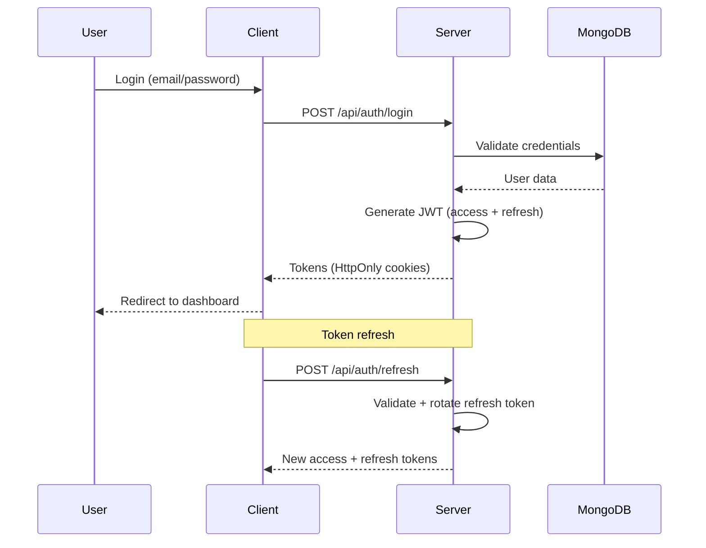

# Mini ClickUp

**Version:** 0.1.0-rescue  
**Last Updated:** 2026-04-17  
**Status:** 🔴 FASE 0 — RESCATE ACTIVO (app no compila en estado actual)  
**Architecture:** MERN Stack + Socket.IO  
**Design System:** Figma CRM Workroom Community (`IOYnTnClPHrmSnWFlKh96O`)  
**Repo:** Public — Branch Protection activa • Dependabot activo • CodeQL activo  

---

## 🎯 Project Overview

**Mini ClickUp** is a streamlined project management platform inspired by ClickUp, built with the same design system and architectural patterns as **Prisma Kirest v2.7.0**.

### Estado Real de Pantallas (Figma → Código)

> ⚠️ El proyecto fue dejado en estado roto. El estado abajo refleja la realidad al 2026-04-17.

```
RUTAS PÚBLICAS (GuestLayout)
├── /login              ✅ 100% — LoginPage.tsx
├── /register           ✅ 100% — RegisterPage.tsx
├── /forgot-password    ⚠️  UI lista, ❌ email flow sin implementar
└── /reset-password     ⚠️  UI lista, ❌ token flow sin implementar

RUTAS PROTEGIDAS (ProtectedLayout)
├── /dashboard          ⚠️  70% — árbol duplicado, datos mock
├── /projects           ⚠️  50% — datos mock, sin API real
├── /tasks              ⚠️  40% — datos mock, sin API real
├── /team               ⚠️  90% — BUG: DELETE devuelve 500
├── /backlog            ❌   0% — stub vacío
├── /chat               ❌  15% — stub, sin Socket.IO
├── /calendar           ❌  20% — stub
└── /settings           ❌  20% — stub
```

### Bugs Críticos (Fase 0 — Bloqueantes)

| ID | Descripción | Prioridad |
|----|-------------|-----------|
| BUG-001 | `DELETE /api/teams/:id` → 500 Internal Server Error | **P0** |
| BUG-002 | `authenticate` sin `()` en routes/projects, tasks, sprint | **P0** |
| BUG-003 | Build TypeScript falla — imports rotos | **P0** |
| BUG-004 | 12/33 tests de teams fallan | **P0** |
| BUG-005 | Árbol dashboard duplicado (`pages/dashboard/app/` vs `DashboardPage.tsx`) | P1 |
| BUG-006 | `axios` directo en hooks viejos en lugar de `services/api.ts` | P1 |
| BUG-007 | Socket.IO naming mixto: kebab-case vs colon-notation | P1 |

### MVP Goal (Post-Rescue)
- Team & Collaborator Management
- Task Management (CRUD + Kanban Board)
- Real-time Chat (Socket.IO)
- Vacation Calendar
- Dashboard con KPIs reales
- Mobile-First Responsive Design

---

## 🏗️ Architecture

### Technology Stack

```yaml
Frontend:
  React: 19 RC
  TypeScript: 5.6.2
  Vite: 6.0.5
  Tailwind CSS: v4 Alpha
  React Router DOM: v7+
  Radix UI: 48 components (from prisma_V0.0.1)
  Framer Motion: 12.0
  Recharts: 2.15
  i18next: 25.8.4
  Socket.IO Client: 4.x

Backend:
  Node.js: 24.x
  Express: 4.x
  MongoDB: 8.x
  Mongoose: 8.x
  Socket.IO: 4.x
  JWT: jsonwebtoken
  bcrypt: 15.x
  Zod: validation

DevOps:
  Husky + lint-staged
  Prettier + ESLint
  Vitest + Playwright
  GitHub Actions (CI/CD)
```

### Project Structure

```
mini-clickup/
├── client/                      # React Frontend
│   ├── src/
│   │   ├── components/
│   │   │   ├── ui/             # 48 Radix UI components (Shadcn)
│   │   │   ├── atoms/          # Atomic Design: Atoms
│   │   │   ├── molecules/      # Atomic Design: Molecules
│   │   │   ├── organisms/      # Atomic Design: Organisms
│   │   │   ├── templates/      # Atomic Design: Templates
│   │   │   └── pages/          # Atomic Design: Pages
│   │   ├── contexts/           # React Context (Auth, Team, Task, Socket)
│   │   ├── hooks/              # Custom hooks (useTasks, useTeam, useChat)
│   │   ├── services/           # API calls + Socket.IO
│   │   ├── utils/              # Helpers, formatters, cn()
│   │   ├── types/              # TypeScript interfaces
│   │   ├── locales/            # i18n (en, es)
│   │   ├── styles/
│   │   │   ├── index.css       # Tailwind + Design Tokens
│   │   │   └── globals.css     # Glassmorphism, utilities
│   │   ├── App.tsx             # Root component + Routing
│   │   └── main.tsx            # Entry point
│   ├── public/
│   ├── index.html
│   ├── vite.config.ts
│   ├── tsconfig.json
│   ├── tailwind.config.ts
│   └── package.json
│
├── server/                      # Express Backend
│   ├── src/
│   │   ├── controllers/        # Request handlers
│   │   ├── models/             # Mongoose schemas
│   │   ├── routes/             # API routes
│   │   ├── middleware/         # Auth, validation, error handling
│   │   ├── services/           # Business logic
│   │   ├── sockets/            # Socket.IO event handlers
│   │   ├── utils/              # Helpers, logger
│   │   └── index.ts            # Server entry point
│   ├── tests/
│   └── package.json
│
├── Documentacion/              # Technical Documentation
│   ├── 00_Indice_General.md
│   ├── 01_Arquitectura_y_Stack.md
│   ├── 02_Metodologias_y_Convenciones.md
│   ├── 03_Componentes_Core.md
│   ├── 04_Servicios_y_Red.md
│   ├── 05_Utilidades_y_Hooks.md
│   ├── 06_Testing_y_QA.md
│   ├── 07_Build_Despliegue.md
│   ├── 08_Internacionalizacion_i18n.md
│   ├── 09_Estado_Global_y_Contextos.md
│   └── 10_Roadmap_y_Deuda_Tecnica.md
│
├── .github/                     # GitHub configuration
│   ├── workflows/              # CI/CD pipelines
│   └── ISSUE_TEMPLATE/         # Issue templates
│
├── .husky/                      # Git hooks
├── .vscode/                     # VS Code settings
├── package.json                 # Root package (scripts)
└── README.md
```

---

## 🚀 Quick Start

### Prerequisites
- Node.js v24.10.0+
- MongoDB v8.x (local or Atlas)
- npm v11.6.1+
- Git v2.46.2+

### Installation

```bash
# Clone repository
git clone git@github.com:<user>/mini-clickup.git
cd mini-clickup

# Install root dependencies
npm install

# Install client dependencies
cd client && npm install

# Install server dependencies
cd ../server && npm install

# Setup environment variables
# Client: client/.env
# Server: server/.env

# Start development (both front + back)
cd ..
npm run dev
```

### Environment Variables

**Client (`client/.env`):**
```env
VITE_API_URL=http://localhost:5000/api
VITE_SOCKET_URL=http://localhost:5000
VITE_APP_NAME=Mini ClickUp
```

**Server (`server/.env`):**
```env
NODE_ENV=development
PORT=5000
MONGODB_URI=mongodb://localhost:27017/mini-clickup
JWT_SECRET=your-super-secret-jwt-key-change-in-production
JWT_EXPIRES_IN=15m
JWT_REFRESH_EXPIRES_IN=7d
BCRYPT_ROUNDS=12
FRONTEND_URL=http://localhost:5173
```

---

## 📐 Design System

### Design Tokens (from Prisma Kirest)

```css
:root {
  /* Colors */
  --primary: #0f172a;          /* Navy */
  --electric-blue: #3b82f6;
  --success: #10b981;
  --warning: #f59e0b;
  --destructive: #ef4444;
  
  /* Neutrals */
  --neutral-50: #f8fafc;
  --neutral-100: #f1f5f9;
  --neutral-200: #e2e8f0;
  --neutral-300: #ced4da;
  --neutral-400: #adb5bd;
  --neutral-500: #868e96;
  --neutral-600: #495057;
  --neutral-700: #343a40;
  --neutral-800: #212529;
  --neutral-900: #0f172a;
  
  /* Glassmorphism */
  --glass-bg: rgba(255, 255, 255, 0.8);
  --glass-border: rgba(15, 23, 42, 0.06);
  --glass-shadow: 0 8px 32px rgba(15, 23, 42, 0.1);
  --blur-md: 16px;
  --blur-lg: 24px;
  
  /* Typography */
  --font-family: 'Inter', -apple-system, BlinkMacSystemFont, 'Segoe UI', sans-serif;
  --font-size-xs: 12px;
  --font-size-sm: 14px;
  --font-size-base: 16px;
  --font-size-lg: 18px;
  --font-size-xl: 20px;
  --font-size-2xl: 24px;
  --font-size-3xl: 30px;
  
  /* Spacing */
  --spacing-xs: 4px;
  --spacing-sm: 8px;
  --spacing-md: 16px;
  --spacing-lg: 24px;
  --spacing-xl: 32px;
  --spacing-2xl: 48px;
  
  /* Border Radius */
  --radius-sm: 4px;
  --radius-md: 8px;
  --radius-lg: 12px;
  --radius-full: 9999px;
}
```

### Glassmorphism Utilities

```css
.glass {
  backdrop-filter: blur(var(--blur-md));
  background: var(--glass-bg);
  border: 1px solid var(--glass-border);
  box-shadow: var(--glass-shadow);
}

.glass-intense {
  backdrop-filter: blur(var(--blur-lg));
  background: rgba(255, 255, 255, 0.9);
  border: 1px solid rgba(255, 255, 255, 0.2);
  box-shadow: 0 20px 40px rgba(15, 23, 42, 0.15);
}
```

---

## 📋 Roadmap — Fase 0 a Fase 5

Todos los issues están en GitHub: [github.com/lodela/mini-clickup/issues](https://github.com/lodela/mini-clickup/issues)

### Progreso por Fase

| Fase | Milestone | Estado | Issues |
|------|-----------|--------|--------|
| **Fase 0** | Phase 0 — Rescue | 🔴 ACTIVA | #2, #3, #4 (epics) · #21–#26 (stories) |
| **Fase 1** | Phase 1 — API Foundation | ⏳ Pendiente | #5, #6, #7 (epics) · #27–#31 (stories) |
| **Fase 2** | Phase 2 — Core Screens | ⏳ Pendiente | #8–#11 (epics) · #32–#40 (stories) |
| **Fase 3** | Phase 3 — Workflow Engine | ⏳ Pendiente | #12–#15 (epics) · #41–#45 (stories) |
| **Fase 4** | Phase 4 — Secondary Screens | ⏳ Pendiente | #16–#19 (epics) · #46–#50 (stories) |
| **Fase 5** | Phase 5 — Polish & Ship | ⏳ Pendiente | #20 (epic) · #51–#52 (stories) |

### Fase 0 — RESCATE (bloqueante) 🔴

**Condición de salida:** `npm run build` ✅ · `npm run test` sin fallos P0

| Epic | Story | Issue | Descripción |
|------|-------|-------|-------------|
| E-RESCUE-01 | S01 | [#21](https://github.com/lodela/mini-clickup/issues/21) | Fix `DELETE /api/teams/:id` → 500 |
| E-RESCUE-01 | S02 | [#22](https://github.com/lodela/mini-clickup/issues/22) | Fix `authenticate` sin paréntesis en routes |
| E-RESCUE-01 | S03 | [#23](https://github.com/lodela/mini-clickup/issues/23) | Pasar los 12 tests fallidos de Teams |
| E-RESCUE-02 | S01 | [#24](https://github.com/lodela/mini-clickup/issues/24) | Fix errores TypeScript para build completo |
| E-RESCUE-02 | S02 | [#25](https://github.com/lodela/mini-clickup/issues/25) | Reconciliar árbol dashboard duplicado |
| E-RESCUE-03 | S01 | [#26](https://github.com/lodela/mini-clickup/issues/26) | Migrar hooks axios → `services/api.ts` |

### Fase 1 — API Foundation 🟡

| Epic | Issue | Descripción |
|------|-------|-------------|
| E-PROJ-01 | [#27](https://github.com/lodela/mini-clickup/issues/27) | Modelo Mongoose de Project |
| E-PROJ-01 | [#28](https://github.com/lodela/mini-clickup/issues/28) | Controller, Service y Routes de Projects |
| E-TASK-01 | [#29](https://github.com/lodela/mini-clickup/issues/29) | Modelo Task con Workflow Fields |
| E-TASK-01 | [#30](https://github.com/lodela/mini-clickup/issues/30) | Controller, Service y Routes de Tasks |
| E-DASH-01 | [#31](https://github.com/lodela/mini-clickup/issues/31) | Endpoint `GET /api/dashboard/stats` |

### Fase 2–5

Ver el [backlog completo de issues](https://github.com/lodela/mini-clickup/issues) con todos los epics (#2–#20) y stories (#21–#52).

### Story Point Tallas

| Talla | Horas | Ejemplo |
|-------|-------|---------|
| **CH** | ≤4h | Bug fix, componente simple |
| **MD** | 4–8h | Feature con lógica moderada |
| **L** | 8–16h | Feature complejo, múltiples archivos |
| **XL** | 16–24h | Sistema completo (ej: drag-and-drop Kanban) |

---

## 🔒 Security & DevOps

### Branch Protection (`main`)

| Regla | Estado |
|-------|--------|
| PR requerido antes de merge | ✅ Activo |
| Mínimo 1 reviewer aprobando | ✅ Activo |
| Stale reviews descartados en nuevo push | ✅ Activo |
| Push directo bloqueado | ✅ Activo |
| Force push bloqueado | ✅ Activo |

### Seguridad Automatizada

| Feature | Estado |
|---------|--------|
| Dependabot alerts | ✅ Activo — 25 vulnerabilidades detectadas |
| Dependabot auto-fix PRs | ✅ Activo |
| CodeQL JS/TS scanning | ✅ [PR #54](https://github.com/lodela/mini-clickup/pull/54) pendiente de merge |

### Branch Naming Convention

```bash
# Formato obligatorio (validado por Husky pre-push)
feature/42-kanban-board
bugfix/21-fix-delete-team-500
hotfix/99-fix-auth-token-expiry
chore/10-upgrade-dependencies
docs/5-update-readme
refactor/33-extract-button
```

### Authentication Flow



### Security Checklist

- [ ] JWT con RS256/ES256 (actualmente HS256 — upgrade pendiente)
- [ ] Access token: 15 minutos
- [ ] Refresh token rotation: 7 días
- [ ] Password: bcrypt cost 12
- [ ] HttpOnly + Secure + SameSite cookies
- [ ] Rate limiting (express-rate-limit)
- [ ] Input validation (Zod)
- [ ] Helmet headers
- [ ] Socket.IO auth en handshake

---

## 🧪 Testing

### Test Strategy

```yaml
Unit Testing:
  framework: Vitest
  coverage_target: 80%
  files: "*.test.ts, *.test.tsx"

Integration Testing:
  framework: Playwright
  browsers: [chromium, firefox, webkit]
  tests: e2e/*.spec.ts

API Testing:
  framework: Supertest + Vitest
  coverage: All endpoints

Socket.IO Testing:
  framework: socket.io-client + Vitest
  focus: Event handlers, rooms, authentication
```

### Run Tests

```bash
# Frontend tests
cd client
npm run test          # Vitest watch
npm run test:run      # Vitest run
npm run test:coverage # Vitest with coverage

# Backend tests
cd server
npm test

# E2E tests
cd client
npm run test:e2e      # Playwright
```

---

## 📦 Deployment

### Build Commands

```bash
# Build frontend
cd client
npm run build

# Build backend
cd server
npm run build

# Production start
npm run start
```

### IIS Deployment (Windows)

1. Build both client and server
2. Configure IIS for static files (client/dist)
3. Configure PM2 or Windows Service for Node.js backend
4. Set up reverse proxy for API routes
5. Configure SSL certificates
6. Set environment variables for production

---


## 🤝 Contributing


```bash
# Branch naming convention — issue number is REQUIRED
feature/42-kanban-board       # New feature (refs issue #42)
bugfix/21-fix-delete-team     # Bug fix (refs issue #21)
hotfix/99-fix-auth-token      # Critical production fix
docs/5-update-readme          # Documentation
refactor/33-extract-button    # Refactoring
chore/10-upgrade-react-19     # Chores, upgrades
```

### Commit Convention

```bash
# Format: <type>(<scope>): <description>
feat(auth): add login with email and password
fix(tasks): resolve drag-and-drop issue on mobile
docs(readme): update installation instructions
refactor(ui): extract button variants to CVA
chore(deps): upgrade React to 19.0.0
```

### Pull Request Process

1. Create feature branch from `main`
2. Implement changes with tests
3. Run linters and tests locally
4. Create PR with description
5. Request review from team
6. Address feedback
7. Merge after approval

---

## 📄 License

Open Source — MIT  
**Repository:** [`lodela/mini-clickup`](https://github.com/lodela/mini-clickup) (Public)  
**Created:** 2026-03-17  

---

## 👥 Team

| Role | Name | GitHub |
|------|------|--------|
| Tech Lead & Developer | Norberto Lodela | [@lodela](https://github.com/lodela) |
| AI Pair Programmer | GitHub Copilot | [@Copilot](https://github.com/features/copilot) |
| Developer | Victor Rangel | _(pending GitHub invite)_ |

---

## 📞 Project Information

**Reference Project:** Prisma Kirest v2.7.0  
**Location:** `~/www/prisma_V0.0.1/`  
**Design Source:** Figma CRM Workroom Community  

---

## 📚 Documentation Index

| Document | Description |
|----------|-------------|
| [01_Arquitectura_y_Stack.md](./Documentacion/01_Arquitectura_y_Stack.md) | Complete stack definition |
| [02_Metodologias_y_Convenciones.md](./Documentacion/02_Metodologias_y_Convenciones.md) | Coding standards, Atomic Design |
| [03_Componentes_Core.md](./Documentacion/03_Componentes_Core.md) | Component inventory |
| [04_Servicios_y_Red.md](./Documentacion/04_Servicios_y_Red.md) | API + Socket.IO architecture |
| [05_Utilidades_y_Hooks.md](./Documentacion/05_Utilidades_y_Hooks.md) | Utils and custom hooks |
| [06_Testing_y_QA.md](./Documentacion/06_Testing_y_QA.md) | Testing strategy |
| [07_Build_Despliegue.md](./Documentacion/07_Build_Despliegue.md) | Build and deployment |
| [08_Internacionalizacion_i18n.md](./Documentacion/08_Internacionalizacion_i18n.md) | Internationalization |
| [09_Estado_Global_y_Contextos.md](./Documentacion/09_Estado_Global_y_Contextos.md) | State management |
| [10_Roadmap_y_Deuda_Tecnica.md](./Documentacion/10_Roadmap_y_Deuda_Tecnica.md) | Roadmap and technical debt |
| [11_Sprint_Plan.md](./Documentacion/11_Sprint_Plan.md) | Sprint plan detallado |
| [12_MVP_Work_Plan.md](./Documentacion/12_MVP_Work_Plan.md) | Work plan completo |
| [13_Roadmap_Rescate_MVP.md](./Documentacion/13_Roadmap_Rescate_MVP.md) | Roadmap de rescate — Fase 0→5 |
| [14_Epicas_y_Criterios.md](./Documentacion/14_Epicas_y_Criterios.md) | Épicas, stories, acceptance criteria |

---

**Last Updated:** 2026-04-17  
**Version:** 0.1.0-rescue  
**Status:** 🔴 Fase 0 — Rescate Activo
