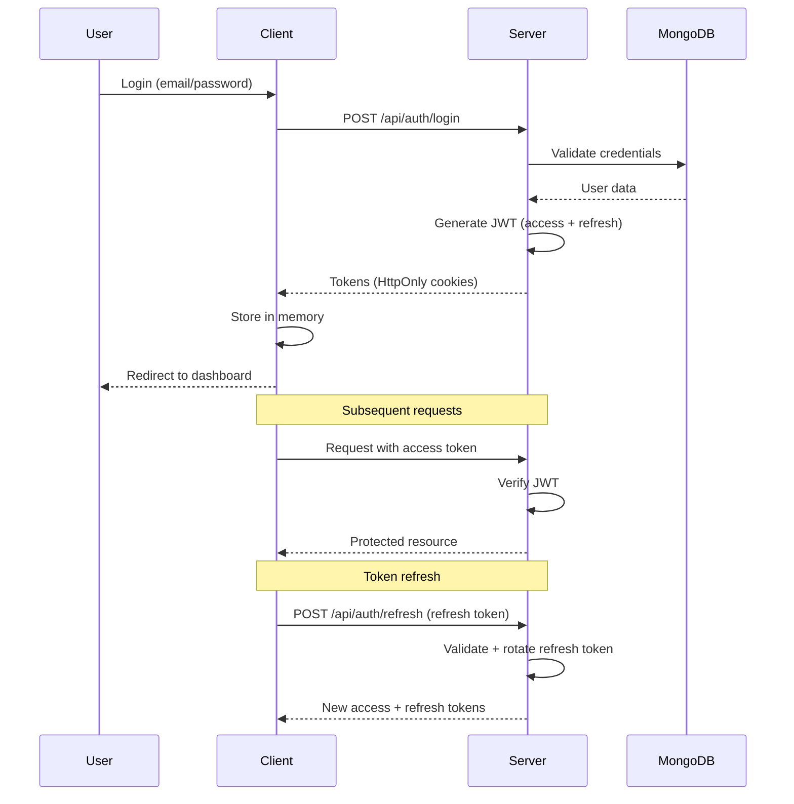

# Mini ClickUp - AI-Driven Project Management Platform

**Version:** 0.1.0 (MVP Development)  
**Created:** 2026-03-17  
**Status:** Greenfield Development  
**Architecture:** MERN Stack + Socket.IO  
**Design System:** Prisma Kirest v2.7.0 Derivative  

---

## 🎯 Project Overview

**Mini ClickUp** is a streamlined project management platform inspired by ClickUp, built with the same design system and architectural patterns as **Prisma Kirest v2.7.0**.

### Core Features (MVP)
- ✅ Team & Collaborator Management
- ✅ Task Management (CRUD + Kanban Board)
- ✅ Real-time Chat (Socket.IO)
- ✅ Vacation Calendar
- ✅ Dashboard with KPIs
- ✅ Mobile-First Responsive Design

### Non-Goals (Post-MVP)
- Advanced reporting & analytics
- Gantt charts
- Time tracking
- Custom fields builder
- Automation rules engine

---

## 🏗️ Architecture

### Technology Stack

```yaml
Frontend:
  React: 19 RC
  TypeScript: 5.6.2
  Vite: 6.0.5
  Tailwind CSS: v4 Alpha
  React Router DOM: v7+
  Radix UI: 48 components (from prisma_V0.0.1)
  Framer Motion: 12.0
  Recharts: 2.15
  i18next: 25.8.4
  Socket.IO Client: 4.x

Backend:
  Node.js: 24.x
  Express: 4.x
  MongoDB: 8.x
  Mongoose: 8.x
  Socket.IO: 4.x
  JWT: jsonwebtoken
  bcrypt: 15.x
  Zod: validation

DevOps:
  Husky + lint-staged
  Prettier + ESLint
  Vitest + Playwright
  GitHub Actions (CI/CD)
```

### Project Structure

```
mini-clickup/
├── client/                      # React Frontend
│   ├── src/
│   │   ├── components/
│   │   │   ├── ui/             # 48 Radix UI components (Shadcn)
│   │   │   ├── atoms/          # Atomic Design: Atoms
│   │   │   ├── molecules/      # Atomic Design: Molecules
│   │   │   ├── organisms/      # Atomic Design: Organisms
│   │   │   ├── templates/      # Atomic Design: Templates
│   │   │   └── pages/          # Atomic Design: Pages
│   │   ├── contexts/           # React Context (Auth, Team, Task, Socket)
│   │   ├── hooks/              # Custom hooks (useTasks, useTeam, useChat)
│   │   ├── services/           # API calls + Socket.IO
│   │   ├── utils/              # Helpers, formatters, cn()
│   │   ├── types/              # TypeScript interfaces
│   │   ├── locales/            # i18n (en, es)
│   │   ├── styles/
│   │   │   ├── index.css       # Tailwind + Design Tokens
│   │   │   └── globals.css     # Glassmorphism, utilities
│   │   ├── App.tsx             # Root component + Routing
│   │   └── main.tsx            # Entry point
│   ├── public/
│   ├── index.html
│   ├── vite.config.ts
│   ├── tsconfig.json
│   ├── tailwind.config.ts
│   └── package.json
│
├── server/                      # Express Backend
│   ├── src/
│   │   ├── controllers/        # Request handlers
│   │   ├── models/             # Mongoose schemas
│   │   ├── routes/             # API routes
│   │   ├── middleware/         # Auth, validation, error handling
│   │   ├── services/           # Business logic
│   │   ├── sockets/            # Socket.IO event handlers
│   │   ├── utils/              # Helpers, logger
│   │   └── index.ts            # Server entry point
│   ├── tests/
│   └── package.json
│
├── Documentacion/              # Technical Documentation
│   ├── 00_Indice_General.md
│   ├── 01_Arquitectura_y_Stack.md
│   ├── 02_Metodologias_y_Convenciones.md
│   ├── 03_Componentes_Core.md
│   ├── 04_Servicios_y_Red.md
│   ├── 05_Utilidades_y_Hooks.md
│   ├── 06_Testing_y_QA.md
│   ├── 07_Build_Despliegue.md
│   ├── 08_Internacionalizacion_i18n.md
│   ├── 09_Estado_Global_y_Contextos.md
│   └── 10_Roadmap_y_Deuda_Tecnica.md
│
├── .github/                     # GitHub configuration
│   ├── workflows/              # CI/CD pipelines
│   └── ISSUE_TEMPLATE/         # Issue templates
│
├── .husky/                      # Git hooks
├── .vscode/                     # VS Code settings
├── package.json                 # Root package (scripts)
└── README.md
```

---

## 🚀 Quick Start

### Prerequisites
- Node.js v24.10.0+
- MongoDB v8.x (local or Atlas)
- npm v11.6.1+
- Git v2.46.2+

### Installation

```bash
# Clone repository
git clone git@github.com:<user>/mini-clickup.git
cd mini-clickup

# Install root dependencies
npm install

# Install client dependencies
cd client && npm install

# Install server dependencies
cd ../server && npm install

# Setup environment variables
# Client: client/.env
# Server: server/.env

# Start development (both front + back)
cd ..
npm run dev
```

### Environment Variables

**Client (`client/.env`):**
```env
VITE_API_URL=http://localhost:5000/api
VITE_SOCKET_URL=http://localhost:5000
VITE_APP_NAME=Mini ClickUp
```

**Server (`server/.env`):**
```env
NODE_ENV=development
PORT=5000
MONGODB_URI=mongodb://localhost:27017/mini-clickup
JWT_SECRET=your-super-secret-jwt-key-change-in-production
JWT_EXPIRES_IN=15m
JWT_REFRESH_EXPIRES_IN=7d
BCRYPT_ROUNDS=12
FRONTEND_URL=http://localhost:5173
```

---

## 📐 Design System

### Design Tokens (from Prisma Kirest)

```css
:root {
  /* Colors */
  --primary: #0f172a;          /* Navy */
  --electric-blue: #3b82f6;
  --success: #10b981;
  --warning: #f59e0b;
  --destructive: #ef4444;
  
  /* Neutrals */
  --neutral-50: #f8fafc;
  --neutral-100: #f1f5f9;
  --neutral-200: #e2e8f0;
  --neutral-300: #ced4da;
  --neutral-400: #adb5bd;
  --neutral-500: #868e96;
  --neutral-600: #495057;
  --neutral-700: #343a40;
  --neutral-800: #212529;
  --neutral-900: #0f172a;
  
  /* Glassmorphism */
  --glass-bg: rgba(255, 255, 255, 0.8);
  --glass-border: rgba(15, 23, 42, 0.06);
  --glass-shadow: 0 8px 32px rgba(15, 23, 42, 0.1);
  --blur-md: 16px;
  --blur-lg: 24px;
  
  /* Typography */
  --font-family: 'Inter', -apple-system, BlinkMacSystemFont, 'Segoe UI', sans-serif;
  --font-size-xs: 12px;
  --font-size-sm: 14px;
  --font-size-base: 16px;
  --font-size-lg: 18px;
  --font-size-xl: 20px;
  --font-size-2xl: 24px;
  --font-size-3xl: 30px;
  
  /* Spacing */
  --spacing-xs: 4px;
  --spacing-sm: 8px;
  --spacing-md: 16px;
  --spacing-lg: 24px;
  --spacing-xl: 32px;
  --spacing-2xl: 48px;
  
  /* Border Radius */
  --radius-sm: 4px;
  --radius-md: 8px;
  --radius-lg: 12px;
  --radius-full: 9999px;
}
```

### Glassmorphism Utilities

```css
.glass {
  backdrop-filter: blur(var(--blur-md));
  background: var(--glass-bg);
  border: 1px solid var(--glass-border);
  box-shadow: var(--glass-shadow);
}

.glass-intense {
  backdrop-filter: blur(var(--blur-lg));
  background: rgba(255, 255, 255, 0.9);
  border: 1px solid rgba(255, 255, 255, 0.2);
  box-shadow: 0 20px 40px rgba(15, 23, 42, 0.15);
}
```

---

## 📋 Agile Development

### Sprint Structure (7-day cycles)

| Sprint | Duration | Focus | Story Points (Tallas) |
|--------|----------|-------|----------------------|
| **Sprint 0** | 3 días | Setup + Scaffold | CH: 5, MD: 1 |
| **Sprint 1** | 7 días | Auth + Teams | CH: 8, MD: 4, L: 2 |
| **Sprint 2** | 7 días | Tasks + Kanban | CH: 6, MD: 4, L: 3, XL: 1 |
| **Sprint 3** | 7 días | Dashboard + Reports | CH: 4, MD: 4, L: 2 |
| **Sprint 4** | 7 días | Chat Real-time | CH: 2, MD: 2, L: 2, XL: 2 |
| **Sprint 5** | 7 días | Calendar + Notifications | CH: 4, MD: 3, L: 2 |

### Story Point Tallas

| Talla | Horas | Complejidad | Ejemplo |
|-------|-------|-------------|---------|
| **CH** | ≤4h | Baja | Componente simple, bug fix |
| **MD** | 4-8h | Media | Feature con lógica moderada |
| **L** | 8-16h | Alta | Feature complejo, múltiples archivos |
| **XL** | 16-24h | Muy Alta | Sistema completo (ej: drag-and-drop) |

---

## 🔒 Security

### Authentication Flow



### Security Checklist

- [ ] JWT with RS256/ES256 (NOT HS256)
- [ ] Access token expiration: 15 minutes
- [ ] Refresh token rotation: 7 days
- [ ] Password hashing: bcrypt cost 12
- [ ] HttpOnly + Secure + SameSite cookies
- [ ] CSRF protection
- [ ] Rate limiting (express-rate-limit)
- [ ] Input validation (Zod)
- [ ] XSS prevention (DOMPurify)
- [ ] Helmet headers
- [ ] Socket.IO authentication on handshake

---

## 🧪 Testing

### Test Strategy

```yaml
Unit Testing:
  framework: Vitest
  coverage_target: 80%
  files: "*.test.ts, *.test.tsx"

Integration Testing:
  framework: Playwright
  browsers: [chromium, firefox, webkit]
  tests: e2e/*.spec.ts

API Testing:
  framework: Supertest + Vitest
  coverage: All endpoints

Socket.IO Testing:
  framework: socket.io-client + Vitest
  focus: Event handlers, rooms, authentication
```

### Run Tests

```bash
# Frontend tests
cd client
npm run test          # Vitest watch
npm run test:run      # Vitest run
npm run test:coverage # Vitest with coverage

# Backend tests
cd server
npm test

# E2E tests
cd client
npm run test:e2e      # Playwright
```

---

## 📦 Deployment

### Build Commands

```bash
# Build frontend
cd client
npm run build

# Build backend
cd server
npm run build

# Production start
npm run start
```

### IIS Deployment (Windows)

1. Build both client and server
2. Configure IIS for static files (client/dist)
3. Configure PM2 or Windows Service for Node.js backend
4. Set up reverse proxy for API routes
5. Configure SSL certificates
6. Set environment variables for production

---

## 🗺️ Roadmap

### MVP (Sprints 0-3) - ~25 días
- [x] Project setup
- [ ] Authentication (Login, Register, JWT)
- [ ] Team management
- [ ] Task CRUD
- [ ] Kanban board
- [ ] Dashboard with KPIs

### Post-MVP (Sprints 4-5) - ~14 días
- [ ] Real-time chat
- [ ] Vacation calendar
- [ ] Notifications system
- [ ] Advanced filters
- [ ] Export reports

### Future Enhancements
- [ ] Gantt charts
- [ ] Time tracking
- [ ] Custom fields builder
- [ ] Automation rules
- [ ] Mobile app (React Native)

---

## 🤝 Contributing

### Git Workflow

```bash
# Branch naming convention
feature/auth-login          # New feature
fix/jwt-token-expiry        # Bug fix
docs/update-readme          # Documentation
refactor/component-extract  # Refactoring
chore/upgrade-react-19      # Chores, upgrades
```

### Commit Convention

```bash
# Format: <type>(<scope>): <description>
feat(auth): add login with email and password
fix(tasks): resolve drag-and-drop issue on mobile
docs(readme): update installation instructions
refactor(ui): extract button variants to CVA
chore(deps): upgrade React to 19.0.0
```

### Pull Request Process

1. Create feature branch from `main`
2. Implement changes with tests
3. Run linters and tests locally
4. Create PR with description
5. Request review from team
6. Address feedback
7. Merge after approval

---

## 📄 License

Private - All rights reserved  
**Repository:** `mini-clickup` (Private)  
**Created:** 2026-03-17  

---

## 📞 Project Information

**Reference Project:** Prisma Kirest v2.7.0  
**Location:** `~/www/prisma_V0.0.1/`  
**Design Source:** Figma CRM Workroom Community  
**Architect:** Milly AI - Master Orchestrator  
**Developer:** Norberto Lodela  

---

## 📚 Documentation Index

| Document | Description |
|----------|-------------|
| [01_Arquitectura_y_Stack.md](./Documentacion/01_Arquitectura_y_Stack.md) | Complete stack definition |
| [02_Metodologias_y_Convenciones.md](./Documentacion/02_Metodologias_y_Convenciones.md) | Coding standards, Atomic Design |
| [03_Componentes_Core.md](./Documentacion/03_Componentes_Core.md) | Component inventory |
| [04_Servicios_y_Red.md](./Documentacion/04_Servicios_y_Red.md) | API + Socket.IO architecture |
| [05_Utilidades_y_Hooks.md](./Documentacion/05_Utilidades_y_Hooks.md) | Utils and custom hooks |
| [06_Testing_y_QA.md](./Documentacion/06_Testing_y_QA.md) | Testing strategy |
| [07_Build_Despliegue.md](./Documentacion/07_Build_Despliegue.md) | Build and deployment |
| [08_Internacionalizacion_i18n.md](./Documentacion/08_Internacionalizacion_i18n.md) | Internationalization |
| [09_Estado_Global_y_Contextos.md](./Documentacion/09_Estado_Global_y_Contextos.md) | State management |
| [10_Roadmap_y_Deuda_Tecnica.md](./Documentacion/10_Roadmap_y_Deuda_Tecnica.md) | Roadmap and technical debt |

---

**Last Updated:** 2026-03-17  
**Version:** 0.1.0  
**Status:** MVP Development
