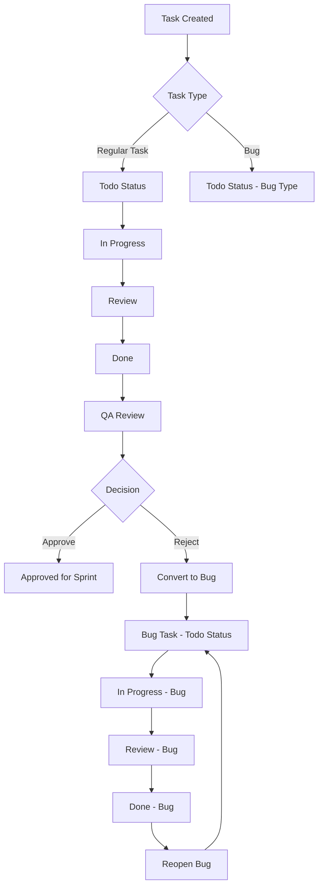
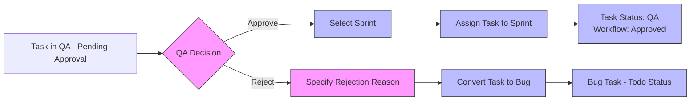
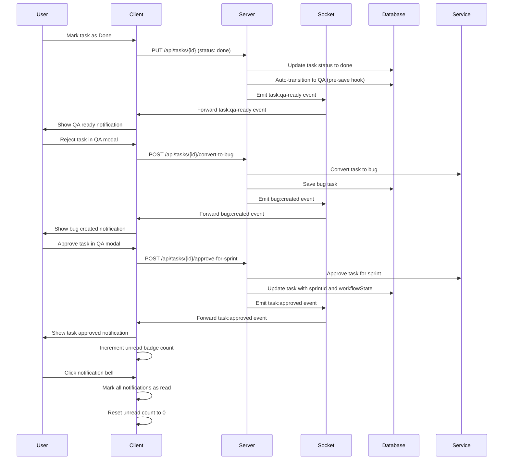
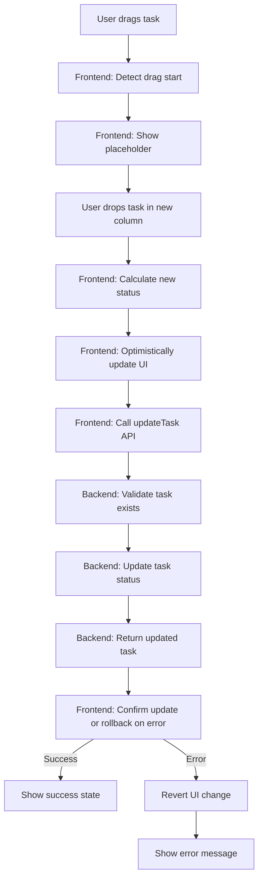
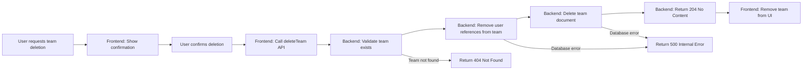

# Mini ClickUp Workflow Flowcharts

## Task Workflow State Diagram

```mermaid
stateDiagram-v2
    [*] --> Todo
    Todo --> "In Progress"
    "In Progress" --> Review
    Review --> Done
    Done --> QA
    QA --> "Approved" : Approve
    QA --> "Rejected (Bug)" : Reject
    "Approved" --> [*] : Assigned to Sprint
    "Rejected (Bug)" --> [*] : Converted to Bug

    %% Auto-transition from Done to QA
    Done --> QA : Auto-transition

    %% Allow moving backward in workflow for corrections
    "In Progress" --> Todo : Move Back
    Review --> "In Progress" : Move Back
    Done --> Review : Move Back
    QA --> Done : Move Back

    %% Allow skipping states for direct completion (if needed)
    Todo --> "In Progress" : Start Work
    "In Progress" --> Done : Skip Review
    Review --> Done : Skip QA
```

## Task Type Conversion Flow



## Sprint Assignment Workflow



## Notification Flow



## Drag-and-Drop Task Reordering (Backlog)



## Team Deletion Flow (Fixed)



## Key Workflow Notes

1. **Automatic QA Transition**: When a task is moved to "done" status, it automatically transitions to "qa" status with workflowState "pending-approval" via Mongoose pre-save hook.

2. **Bug Conversion**: Only tasks (not bugs) can be converted to bugs. The conversion resets the task to "todo" status, changes type to "bug", and clears sprint assignment.

3. **Sprint Approval**: Only tasks in QA status with workflowState "pending-approval" can be approved for a sprint. Approval sets workflowState to "approved" and assigns sprintId.

4. **State Integrity**: The workflow prevents invalid state transitions through both backend validation and automatic hooks.

5. **Real-time Updates**: Socket.IO events notify clients of workflow changes for immediate UI updates without polling.

6. **Notifications**: Users receive real-time notifications for QA-ready tasks, bug creations, and sprint approvals via Socket.IO.

These flowcharts represent the core workflows implemented in the Mini ClickUp MVP as of the current development stage.
